## De Uitdaging

Bij grote e-commerce bedrijven is klantenservice vaak de bottleneck voor groei. Traditionele "chatbots" zijn te rigide, wekken frustratie op en kunnen geen echte acties ondernemen. Menselijke agenten zijn empathisch, maar duur en traag op te schalen tijdens piekseizoenen.

**Het Doel:** Bouw een systeem dat niet alleen e-mails "beantwoordt", maar **tickets daadwerkelijk oplost**—inclusief terugbetalingen, adreswijzigingen en onderhandelingen—terwijl het strikt de bedrijfsregels naleeft.

## De Oplossing: Een Hybride Architectuur

Ik heb een event-driven backend ontworpen met **Python** en **FastAPI**. In tegenstelling tot standaard wrappers rondom OpenAI, gebruikt dit systeem **LangGraph** om de status te behouden. Het onthoudt de gespreksgeschiedenis, onderhandelingsfasen en context, waardoor het kan "nadenken" voordat het handelt.

Het maakt gebruik van een **Hybride Beslissingsmotor**: Een LLM voor begrip en toon, maar hard-coded Python-logica voor kritieke zakelijke beslissingen (financiële drempels, retourtermijnen).

### Systeem Architectuur

Het systeem werkt als een continue cyclus van **Waarnemen, Redeneren en Handelen**.

```mermaid
graph TB
    subgraph External["Externe Wereld"]
        Customer([👤 Klant])
        Shopify[🛍️ Shopify API]
        VectorDB[(🧠 Qdrant RAG)]
    end

    subgraph Core["AI Agent Core (Python/FastAPI)"]
        direction TB
        Ingest[📨 Ingestie & Spam Filter]
        Context[search: Context Verrijking]
        Brain[⚡️ LangGraph State Machine]
        
        subgraph Logic["Beslissingsmotor"]
            Router{⚖️ Hybride Router}
            Guardrails[🛡️ Python Regels]
        end
        
        Tools[🛠️ Actie Uitvoerder]
        Escalate[🚨 Menselijke Review]
        Reply[📝 Respons Generatie]
    end

    %% Flow
    Customer -- "Stuurt E-mail (AWS SES)" --> Ingest
    Ingest --> Context
    Context -- "Haal Order Data" --> Shopify
    Context --> Brain
    Brain -- "Zoek Beleid" --> VectorDB
    VectorDB --> Brain
    Brain --> Router
    
    Router -- "Veilige Actie" --> Guardrails
    Guardrails -- "Goedgekeurd" --> Tools
    Tools -- "Geef Refund/Krediet" --> Shopify
    Tools --> Brain
    
    Router -- "Hoog Risico / Dispute" --> Escalate
    Router -- "Alleen Informatie" --> Reply
    
    Reply -- "Verstuur E-mail (Postmark)" --> Customer

    %% Styling
    style Core fill:transparent,stroke:#71717a,stroke-width:2px,color:#fff
    style Logic fill:#18181b,stroke:#a855f7,stroke-width:2px,color:#fff
    style Brain fill:#27272a,stroke:#3b82f6,stroke:#3b82f6,stroke-width:2px,color:#fff
    style Router fill:#7e22ce,stroke:#fff,stroke-width:2px,color:#fff
```

## Belangrijkste Technische Functies

### 1. Geheugen met Status (LangGraph)
Standaard AI-implementaties zijn staatloos—ze vergeten de vorige e-mail direct. Ik heb **LangGraph** geïmplementeerd om een toestandsmachine te creëren. De agent weet precies waar hij zich in een onderhandeling bevindt.
*   *Scenario:* Als de agent een terugbetaling van 20% aanbiedt en de klant weigert, onthoudt de agent de afwijzing en controleert zijn interne status om te zien of hij bevoegd is om te escaleren naar 30%.

### 2. Retrieval-Augmented Generation (RAG)
Om hallucinaties te voorkomen, vertrouwt de agent niet op de trainingsdata van de LLM voor bedrijfsbeleid. Ik heb **Qdrant** (Vector Database) geïmplementeerd om specifieke kennis tijdens runtime in te voegen.
*   Voordat hij antwoordt, vraagt de agent aan de database: *"Wat is het beleid voor het retourneren van beschadigde goederen in Duitsland?"*
*   Dit garandeert dat antwoorden feitelijk juist en juridisch conform zijn.

### 3. Programmatische "Guardrails" (De Hybride Aanpak)
Dit is het vangnet. De LLM suggereert een intentie (bijv. `Refund_Quality_Issue`), maar **Python-code** neemt de uiteindelijke beslissing.
*   **De LLM** wil de klant terugbetalen.
*   **De Code** controleert de orderdatum in de database.
*   **Resultaat:** Als de order >30 dagen oud is, dwingt de code een afwijzing af, ongeacht hoe beleefd de klant is. Dit voorkomt dat de AI via "social engineering" geld weggeeft.

## De Workflow

1.  **Ingestie:** Inkomende e-mails triggeren een webhook via AWS SES. De ruwe data wordt geparsed en opgeslagen in MongoDB.
2.  **Context Verrijking:** De agent haalt de ordergeschiedenis op uit Shopify en checkt live verzendstatus via tracking API's. Hij weet *precies* waar het pakket is voordat hij de e-mail leest.
3.  **Redeneren:** De agent bepaalt de intentie. Is de klant boos? Is het pakket kwijt? Is het een retourverzoek?
4.  **Actie:** Indien geldig, voert hij tools direct uit via API (bijv. winkelkrediet geven of retourlabel maken) zonder menselijke input.
5.  **Escalatie:** Als een klant dreigende taal gebruikt (bijv. "chargeback", "advocaat"), stopt de AI direct en routeert het ticket naar een menselijke supervisor via een custom dashboard.

## Prestaties & Impact

Dit systeem is ontworpen om te draaien op bare-metal efficiëntie, wat bewijst dat enterprise-grade AI geen enorme cloudkosten vereist.

*   **Efficiëntie:** Kan duizenden tickets per dag asynchroon verwerken via **Celery**.
*   **Kosten:** Lage operationele kosten (~€0.002 per oplossing) vergeleken met menselijke agenten.
*   **Infrastructuur:** Volledig gecontaineriseerd met **Docker**, beheerd via **Nginx**, en in staat om te draaien op energiezuinige Linux-hardware.

## Tech Stack

*   **Taal:** Python 3.11
*   **Framework:** FastAPI
*   **AI Logica:** LangChain, LangGraph
*   **Database:** MongoDB (Transactioneel), Qdrant (Vector/RAG)
*   **Async Processing:** Celery, Redis
*   **Externe API's:** Shopify, OpenAI (GPT-4), AWS SES, Postmark