## The Challenge

In high-volume e-commerce, customer service is often the bottleneck for scale. Traditional "chatbots" are too rigid, frustration-inducing, and unable to take real actions. Human agents are empathetic but expensive and slow to scale during peak seasons.

**The Goal:** Build a system that doesn't just "reply" to emails, but actually **resolves tickets** autonomously—handling refunds, address changes, and negotiations—while strictly adhering to company policy.

## The Solution: A Hybrid Architecture

I engineered an event-driven backend using **Python** and **FastAPI**. Unlike standard wrappers around OpenAI, this system utilizes **LangGraph** to maintain state. It remembers conversation history, negotiation stages, and context, allowing it to "think" before it acts.

It employs a **Hybrid Decision Engine**: It uses an LLM for understanding and tone, but relies on hard-coded Python logic for critical business decisions (financial thresholds, return windows).

### System Architecture

The system operates as a continuous cycle of **Perception, Reasoning, and Action**.

```mermaid
graph TB
    subgraph External["External World"]
        Customer([👤 Customer])
        Shopify[🛍️ Shopify API]
        VectorDB[(🧠 Qdrant RAG)]
    end

    subgraph Core["AI Agent Core (Python/FastAPI)"]
        direction TB
        Ingest[📨 Ingestion & Spam Filter]
        Context[search: Context Enrichment]
        Brain[⚡️ LangGraph State Machine]
        
        subgraph Logic["Decision Engine"]
            Router{⚖️ Hybrid Router}
            Guardrails[🛡️ Python Guardrails]
        end
        
        Tools[🛠️ Action Executor]
        Escalate[🚨 Human Handoff]
        Reply[📝 Response Gen]
    end

    %% Flow
    Customer -- "Sends Email (AWS SES)" --> Ingest
    Ingest --> Context
    Context -- "Fetch Order Data" --> Shopify
    Context --> Brain
    Brain -- "Query Policy" --> VectorDB
    VectorDB --> Brain
    Brain --> Router
    
    Router -- "Safe Action" --> Guardrails
    Guardrails -- "Approved" --> Tools
    Tools -- "Issue Refund/Credit" --> Shopify
    Tools --> Brain
    
    Router -- "High Risk / Dispute" --> Escalate
    Router -- "Information Only" --> Reply
    
    Reply -- "Send Email (Postmark)" --> Customer

    %% Styling
    style Core fill:transparent,stroke:#71717a,stroke-width:2px,color:#fff
    style Logic fill:#18181b,stroke:#a855f7,stroke-width:2px,color:#fff
    style Brain fill:#27272a,stroke:#3b82f6,stroke:#3b82f6,stroke-width:2px,color:#fff
    style Router fill:#7e22ce,stroke:#fff,stroke-width:2px,color:#fff
```

## Key Technical Features

### 1. Stateful Memory (LangGraph)
Standard AI implementations are stateless—they forget the previous email immediately. I implemented **LangGraph** to create a state machine. The agent knows exactly where it is in a negotiation.
*   *Scenario:* If the agent offers a 20% refund and the customer declines, the agent remembers the rejection and checks its internal state to see if it is authorized to escalate to 30%.

### 2. Retrieval-Augmented Generation (RAG)
To prevent hallucinations, the agent does not rely on the LLM's training data for company policies. I implemented **Qdrant** (Vector Database) to inject specific knowledge at runtime.
*   Before answering, the agent queries the vector DB: *"What is the policy for returning damaged goods in Germany?"*
*   This ensures answers are factually accurate and legally compliant.

### 3. Programmatic Guardrails (The "Hybrid" Approach)
This is the safety net. The LLM suggests an intent (e.g., `Refund_Quality_Issue`), but **Python code** makes the final decision.
*   **The LLM** wants to refund the customer.
*   **The Code** checks the order date against the database.
*   **Result:** If the order is >30 days old, the code forces a rejection, regardless of how polite the customer is. This prevents the AI from being "socially engineered" into giving away money.

## The Workflow

1.  **Ingestion:** Incoming emails trigger a webhook via AWS SES. The raw data is parsed, sanitized, and stored in MongoDB.
2.  **Context Enrichment:** The agent pulls the customer's order history from Shopify and checks live shipping status via tracking APIs. It knows *exactly* where the package is before reading the email.
3.  **Reasoning:** The agent determines the intent. Is the customer angry? Is the package lost? Is it a return request?
4.  **Action:** If valid, it executes tools directly via API (e.g., issuing store credit or creating a return label) without human input.
5.  **Escalation:** If a customer uses threatening language (e.g., "chargeback", "lawyer"), the AI immediately halts and routes the ticket to a human supervisor via a custom dashboard.

## Performance & Impact

This system was designed to run on bare-metal efficiency, proving that enterprise-grade AI doesn't require massive cloud costs.

*   **Efficiency:** Capable of processing thousands of tickets daily asynchronously via **Celery**.
*   **Cost:** Low operational cost (~€0.002 per resolution) compared to human agents.
*   **Infrastructure:** Fully containerized with **Docker**, managed via **Nginx**, and capable of running on low-power Linux hardware.

## Tech Stack

*   **Language:** Python 3.11
*   **Framework:** FastAPI
*   **AI Logic:** LangChain, LangGraph
*   **Database:** MongoDB (Transactional), Qdrant (Vector/RAG)
*   **Async Processing:** Celery, Redis
*   **External APIs:** Shopify, OpenAI (GPT-4), AWS SES, Postmark