## De Interface

Terwijl de AI Agent en de MKSL Engine het zware werk op de achtergrond doen, is **MKAI CRM** waar de controle plaatsvindt. Het is een uniform, real-time admin dashboard gebouwd met **Next.js** dat data van alle microservices samenbrengt in één "Mission Control" interface.

Het transformeert complexe, event-driven backend-processen naar een schone, bruikbare UI voor supportmedewerkers en beheerders.

## Belangrijkste Modules

### 1. Human-in-the-Loop (HITL) Console
De AI Agent handelt 80% van de tickets autonoom af. Dit dashboard beheert de overige 20%.
*   **Live Interventie:** Supervisors kunnen AI-gesprekken real-time volgen via WebSockets.
*   **Goedkeuringsworkflows:** Gevoelige acties (zoals 100% terugbetalingen) verschijnen in een speciale wachtrij voor goedkeuring met één klik.
*   **Context Injectie:** Admins kunnen instructies in de context van de AI injecteren om specifieke onderhandelingen te sturen.

### 2. MKSL Launchpad
Een visuele interface voor de geautomatiseerde E-commerce engine.
*   **Scraper Visualisatie:** Bekijk ruwe data gescrapet van concurrenten naast door AI verbeterde content.
*   **Creatieve Goedkeuring:** Beoordeel door AI gegenereerde advertentie-assets (afbeeldingen/tekst) voordat ze naar Facebook Ads worden gepusht.
*   **Prestatie Scorecards:** Visuele grafieken die de "Bereiksnelheid" en "Vertrouwensscore" van potentiële producten tonen.

### Systeem Architectuur

De frontend fungeert als consument voor meerdere event-stromen.

```mermaid
graph LR
    User[👨‍💻 Admin Gebruiker] --> Dashboard[🖥️ Next.js Dashboard]
    
    subgraph "Real-Time Data Laag"
        Dashboard -- "Socket.IO" --> WS[WebSocket Server]
        Dashboard -- "REST API" --> Gateway[Nginx API Gateway]
    end
    
    WS <--> Agent[🤖 AI Agent Events]
    WS <--> MKSL[🚀 MKSL Events]
    
    Gateway --> DB[(MongoDB Data)]
    Gateway --> Vector[(Qdrant Vector DB)]
```

## Technische Implementatie

*   **State Management:** Gebruikt **TanStack Query (React Query)** voor robuuste server-state synchronisatie, caching en optimistische updates.
*   **Real-Time Updates:** Geïntegreerde **Socket.IO** client om directe updates te ontvangen over ticketstatus en advertentie-uitgaven zonder polling.
*   **Design System:** Gebouwd met **Shadcn UI** en **Tailwind CSS** voor een toegankelijke, professionele en consistente componentenbibliotheek.

## Live Demo

Bekijk een read-only versie van het dashboard hier: [mkai-crm-frontend-demo.vercel.app](http://mkai-crm-frontend-demo.vercel.app/)