## The Interface

While the AI Agent and MKSL Engine do the heavy lifting in the background, **MKAI CRM** is where control happens. It is a unified, real-time admin dashboard built with **Next.js** that aggregates data from all microservices into a single "Mission Control" interface.

It transforms complex, event-driven backend processes into a clean, usable UI for support staff and administrators.

## Key Modules

### 1. Human-in-the-Loop (HITL) Console
The AI Agent handles 80% of tickets autonomously. This dashboard handles the remaining 20%.
*   **Live Intervention:** Supervisors can see AI conversations in real-time via WebSockets.
*   **Approval Workflows:** Sensitive actions (like 100% refunds) appear in a dedicated queue for one-click approval or rejection.
*   **Context Injection:** Admins can inject instructions into the AI's context to guide specific negotiations.

### 2. MKSL Launchpad
A visual interface for the automated E-commerce engine.
*   **Scraper Visualization:** View raw data scraped from competitors alongside AI-generated enhancements.
*   **Creative Approval:** Review AI-generated ad creatives (images/copy) before they are pushed to Facebook Ads.
*   **Performance Scorecards:** Visual graphs showing the "Reach Velocity" and "Confidence Score" of potential products.

### System Architecture

The frontend acts as the consumer for multiple event streams.

```mermaid
graph LR
    User[👨‍💻 Admin User] --> Dashboard[🖥️ Next.js Dashboard]
    
    subgraph "Real-Time Data Layer"
        Dashboard -- "Socket.IO" --> WS[WebSocket Server]
        Dashboard -- "REST API" --> Gateway[Nginx API Gateway]
    end
    
    WS <--> Agent[🤖 AI Agent Events]
    WS <--> MKSL[🚀 MKSL Events]
    
    Gateway --> DB[(MongoDB Data)]
    Gateway --> Vector[(Qdrant Vector DB)]
```

## Technical Implementation

*   **State Management:** Uses **TanStack Query (React Query)** for robust server-state synchronization, caching, and optimistic UI updates.
*   **Real-Time Updates:** Integrated **Socket.IO** client to receive instant updates on ticket status changes and ad spend metrics without polling.
*   **Design System:** Built using **Shadcn UI** and **Tailwind CSS**, providing a fully accessible, professional, and consistent component library.

## Live Demo

You can view a read-only version of the dashboard here: [mkai-crm-frontend-demo.vercel.app](http://mkai-crm-frontend-demo.vercel.app/)