## Automatisering Ontmoet Creativiteit

Snelheid is cruciaal bij het testen, maar kwaliteit verkoopt. Deze engine lost de "kwaliteit versus snelheid" afweging op door AI te gebruiken om direct professionele advertentie-assets te genereren.

In plaats van handmatig teksten te schrijven en foto's te bewerken voor elke test, neemt het systeem een ruwe productinvoer en levert een lanceerklare Facebook CBO-campagne op.

## De AI Pipeline

1.  **Copywriting:** Gebruikt GPT-4 om psychologische hooks, scroll-stoppende koppen en voordeelgerichte beschrijvingen te genereren, afgestemd op de taal van de specifieke markt.
2.  **Visuele Verbetering:** Gebruikt beeldverwerkingspijplijnen (Photoroom API + Custom Python Scripts) om rommelige achtergronden te verwijderen, producten te centreren en conversie-geoptimaliseerde overlays toe te passen.
3.  **Structuur:** Bouwt automatisch de JSON-structuur die vereist is door Facebook's Marketing API, inclusief de juiste tracking parameters.

### Creatie Flow

```mermaid
graph TB
    Input[📦 Ruwe Product Data] --> Split{Split Proces}
    
    subgraph "Visuele Pipeline"
        Split --> Clean[🧼 Achtergrond Verwijdering]
        Clean --> Enhance[✨ AI Upscaling]
        Enhance --> Optimize["🎨 Formatteren voor IG/FB Feeds"]
    end
    
    subgraph "Tekst Pipeline"
        Split --> GPT[🤖 GPT-4 Analyse]
        GPT --> Hook[🪝 Genereer Hooks]
        GPT --> Body[📝 Schrijf Verkooptekst]
    end
    
    Optimize --> Assembly[📦 Creatieve Samenstelling]
    Body --> Assembly
    Assembly --> FB[🚀 Push naar Facebook Ads Manager]
```

## Impact

*   **Lanceersnelheid:** Campagnecreatietijd teruggebracht van **45 minuten naar 30 seconden**.
*   **Conversieratio:** AI-verbeterde afbeeldingen toonden een **15% hogere CTR** in vergelijking met ruwe leveranciersafbeeldingen.
*   **Lokalisatie:** Vertaalt en culturaliseert advertenties automatisch voor Duitse, Franse en Nederlandse markten.