## Automation Meets Creativity

Speed is critical in testing, but quality sells. This engine solves the "quality vs speed" trade-off by using AI to generate professional-grade ad assets instantly.

Instead of manually writing copy and editing photos for every test, the system takes a raw product input and outputs a ready-to-launch Facebook CBO campaign.

## The AI Pipeline

1.  **Copywriting:** Uses GPT-4 to generate psychological hooks, scroll-stopping headlines, and benefits-driven descriptions tailored to the specific market language.
2.  **Visual Enhancement:** Uses image processing pipelines (Photoroom API + Custom Python Scripts) to remove messy backgrounds, center products, and apply conversion-optimized overlays.
3.  **Structure:** Automatically builds the JSON structure required by Facebook's Marketing API, including proper tracking parameters.

### Creative Generation Flow

```mermaid
graph TB
    Input[📦 Raw Product Data] --> Split{Split Process}
    
    subgraph "Visual Pipeline"
        Split --> Clean[🧼 Background Removal]
        Clean --> Enhance[✨ AI Upscaling]
        Enhance --> Optimize[🎨 Format for IG/FB Feeds]
    end
    
    subgraph "Text Pipeline"
        Split --> GPT[🤖 GPT-4 Analysis]
        GPT --> Hook[🪝 Generate Hooks]
        GPT --> Body[📝 Write Sales Copy]
    end
    
    Optimize --> Assembly[📦 Creative Assembly]
    Body --> Assembly
    Assembly --> FB[🚀 Push to Facebook Ads Manager]
```

## Impact

*   **Launch Speed:** Reduced campaign creation time from **45 minutes to 30 seconds**.
*   **Conversion Rate:** AI-enhanced images showed a **15% increase in CTR** compared to raw supplier images.
*   **Localization:** Automatically translates and culturalizes ads for German, French, and Dutch markets.