## Het Probleem: Data Vertraging

Standaard analysetools (zoals Facebook Ads Manager) hebben vaak aanzienlijke vertragingen of attributiegaten. Bij campagnes met hoge uitgaven is 4-6 uur wachten om te weten of je winstgevend bent onacceptabel.

## De Oplossing

Ik heb een aangepaste analyse-aggregatiemotor gebouwd die een **Unified Source of Truth** creëert. Het haalt live uitgavendata direct uit de Facebook Marketing API en correleert deze direct met Shopify order-webhooks.

Het systeem toont niet alleen data; het **leert**. Het houdt een geheugen bij van productprestaties over verschillende winkels en tijdsbestekken heen, waardoor de Orchestrator slimmere lanceringsbeslissingen kan nemen.

### Data Pipeline

```mermaid
graph LR
    FB[Facebook Ads API] -- "Live Spend & Impressions" --> Aggregator[📊 Data Aggregator]
    Shopify[Shopify Webhooks] -- "Real-time Orders" --> Aggregator
    
    subgraph "Processing Core"
        Aggregator --> ROAS{Bereken Echte ROAS}
        ROAS --> Profit[Winst Analyse]
        Profit --> Memory[(Product Geheugen)]
    end
    
    Memory -- "Optimalisatie Signalen" --> Orchestrator[MKSL Engine]
    Memory --> Dashboard[Frontend Dashboard]
```

## Belangrijkste Mogelijkheden

*   **Real-Time ROAS:** Berekent Return on Ad Spend direct, wat besluitvorming mogelijk maakt minuten na lancering in plaats van uren.
*   **Product Geheugen:** Elk product heeft een "permanent dossier". Als een product 6 maanden geleden faalde, onthoudt het systeem waarom (lage CTR, slechte ROAS) en waarschuwt het tegen hertesten tenzij de omstandigheden veranderen.
*   **Cross-Store Attributie:** Volgt de prestaties van één product over meerdere internationale winkels en normaliseert valutaconversie automatisch.