## The Problem: Data Latency

Standard analytics tools (like Facebook Ads Manager) often have significant data delays or attribution gaps. In high-spend campaigns, waiting 4-6 hours to know if you are profitable is unacceptable.

## The Solution

I built a custom analytics aggregation engine that creates a **Unified Source of Truth**. It pulls live spend data directly from the Facebook Marketing API and correlates it instantly with Shopify order webhooks.

The system doesn't just display data; it **learns**. It maintains a memory of product performance across different stores and timeframes, allowing the Orchestrator to make smarter launch decisions.

### Data Pipeline

```mermaid
graph LR
    FB[Facebook Ads API] -- "Live Spend & Impressions" --> Aggregator[📊 Data Aggregator]
    Shopify[Shopify Webhooks] -- "Real-time Orders" --> Aggregator
    
    subgraph "Processing Core"
        Aggregator --> ROAS{Calculate True ROAS}
        ROAS --> Profit[Profit Analysis]
        Profit --> Memory[(Product Memory)]
    end
    
    Memory -- "Optimization Signals" --> Orchestrator[MKSL Engine]
    Memory --> Dashboard[Frontend Dashboard]
```

## Key Capabilities

*   **Real-Time ROAS:** Calculates Return on Ad Spend instantly, enabling decision-making minutes after launch rather than hours.
*   **Product Memory:** Every product has a "permanent record." If a product failed 6 months ago, the system remembers why (low CTR, bad ROAS) and warns against re-testing unless conditions change.
*   **Cross-Store Attribution:** Tracks a single product's performance across multiple international stores, normalizing currency conversion automatically.