## De Motor

Het runnen van een e-commerce operatie met hoog volume vereist precisie en constante besluitvorming. Mensen zijn traag en hebben slaap nodig; **MKSL (Mkai Scale Launcher)** niet.

Deze orkestratiemotor is het centrale zenuwstelsel van mijn e-commerce infrastructuur. Hij wordt dagelijks wakker via cron-jobs, analyseert marktdata, selecteert producten op basis van complexe vertrouwensalgoritmen en orkestreert de lancering over meerdere webwinkels.

## Algoritmische Besluitvorming

De planner kiest niet zomaar "willekeurige producten". Hij gebruikt een gelaagde algoritmische strategie om de ROI te maximaliseren:

1.  **Winnaar Expansie:** Identificeert producten die veel omzet genereren in één markt en prioriteert deze voor lancering in onaangeboorde markten.
2.  **Visuele Gelijkenis Vector Zoeken:** Gebruikt RAG en vector embeddings (Qdrant) om producten te vinden die visueel lijken op huidige top-performers (98% nauwkeurigheid), gokkend op esthetische trends.
3.  **Nieuw Hoog-Potentieel:** Selecteert producten die visueel *anders* zijn dan huidige winnaars, maar hoge externe vertrouwensscores hebben, om de portfolio te diversifiëren.
4.  **Wildcard:** Een diversiteits-injectie algoritme dat hoog scorende maar ongeteste productcategorieën kiest om stagnatie van de catalogus te voorkomen.

### Orkestratie Flow

```mermaid
graph TD
    Cron[⏰ Cron Scheduler] --> WakeUp[🚀 Wakker Worden & Telegram Melding]
    WakeUp --> Algo{Algoritme Selector}
    
    Algo -- "Bewezen Winnaars" --> Expansion[📈 Winnaar Expansie]
    Algo -- "Visuele Match" --> Vector["🧠 Vector Zoeken (Qdrant)"]
    Algo -- "Diversiteit" --> Wildcard[🎲 Wildcard Selectie]
    
    Expansion --> Queue[⚡️ BullMQ Launch Wachtrij]
    Vector --> Queue
    Wildcard --> Queue
    
    Queue --> Worker1[🏗️ Winkel Bouwer]
    Queue --> Worker2[🎨 Advertentie Maker]
    Queue --> Worker3[📢 Campagne Launcher]
    
    Worker3 --> Telegram[📱 Telegram Rapport]
```

## Technische Hoogtepunten

*   **Event-Driven Architectuur:** Gebouwd op **Node.js** en **BullMQ (Redis)** om duizenden gelijktijdige taken af te handelen zonder te blokkeren.
*   **Real-Time Communicatie:** Gebruikt **Socket.IO** om live updates naar het dashboard te sturen en **Telegram Bot API** voor admin-waarschuwingen.
*   **Vertrouwensscore:** Een eigen wiskundig model dat data van scrapers en advertentiebibliotheken aggregeert om een `0-20` waarschijnlijkheidsscore toe te kennen aan elk productblok.