## The Engine

Running a high-volume e-commerce operation requires precision timing and constant decision-making. Humans are slow and need sleep; **MKSL (Mkai Scale Launcher)** does not.

This orchestration engine is the central nervous system of my e-commerce infrastructure. It wakes up daily via cron jobs, analyzes market data, selects products based on complex confidence algorithms, and orchestrates the launch across multiple storefronts.

## Algorithmic Decision Making

The scheduler doesn't just "pick random products." It uses a tiered algorithmic strategy to maximize ROI:

1.  **Winner Expansion:** Identifies products generating high sales in one market and prioritizes them for launch in untap markets.
2.  **Visual Similarity Vector Search:** Uses RAG and vector embeddings (Qdrant) to find products visually similar to current top-performers (98% accuracy), betting on aesthetic trends.
3.  **New High-Potential:** Selects products that are visually *distinct* from current winners but have high external confidence scores, diversifying the portfolio.
4.  **Wildcard:** A diversity-injection algorithm that picks high-scoring but untested product categories to prevent catalog stagnation.

### Orchestration Flow

```mermaid
graph TD
    Cron[⏰ Cron Scheduler] --> WakeUp[🚀 Wake Up & Notify Telegram]
    WakeUp --> Algo{Algorithm Selector}
    
    Algo -- "Proven Winners" --> Expansion[📈 Winner Expansion]
    Algo -- "Visual Match" --> Vector["🧠 Vector Search (Qdrant)"]
    Algo -- "Diversity" --> Wildcard[🎲 Wildcard Selection]
    
    Expansion --> Queue[⚡️ BullMQ Launch Queue]
    Vector --> Queue
    Wildcard --> Queue
    
    Queue --> Worker1[🏗️ Store Builder]
    Queue --> Worker2[🎨 Ad Creator]
    Queue --> Worker3[📢 Campaign Launcher]
    
    Worker3 --> Telegram[📱 Telegram Report]
```

## Technical Highlights

*   **Event-Driven Architecture:** Built on **Node.js** and **BullMQ (Redis)** to handle thousands of concurrent jobs without blocking.
*   **Real-Time Communication:** Uses **Socket.IO** to push live updates to the frontend dashboard and **Telegram Bot API** for admin alerts.
*   **Confidence Scoring:** A proprietary mathematical model that aggregates data from scrapers and ad libraries to assign a `0-20` probability score to every product block.