## Voorspellende Commerce

Voordat een product wordt gelanceerd, beoordeelt de Scout Agent de levensvatbaarheid ervan. Hij gokt niet; hij berekent. Door externe signalen van concurrenten en advertentieplatforms te analyseren, bouwt hij een "Vertrouwensscore" op die bepaalt of en wanneer een product getest moet worden.

## Hoe het Werkt

De agent werkt autonoom en voedt data in de MKSL Orchestrator.

1.  **Concurrentieverkeer Analyse:** Scraped drukbezochte E-commerce- en merkwinkels om trending items te identificeren.
2.  **Ad Library Mining:** Monitort de Facebook Ad Library. Het houdt bij wanneer advertenties zijn gelanceerd en hoe lang ze actief zijn.
3.  **Bereiksnelheid Berekening:**
    *   *Formule:* `(Geschatte Impressies / Actieve Dagen) * Schaalfactor`
    *   Deze metriek onthult of een concurrent een product agressief opschaalt (hoge snelheid) of het gewoon onderhoudt (lage snelheid).

### Scouting Architectuur

```mermaid
graph LR
    Target[🎯 Doel Winkels] --> Scraper[🕷️ Puppeteer Cluster]
    AdLib[Facebook Ad Library] --> Analyzer[📉 Signaal Analyser]
    
    Scraper --> RawData[(Ruwe Data)]
    Analyzer --> RawData
    
    RawData --> Calc{Snelheid Calculator}
    
    Calc -- "Hoge Snelheid (>80%)" --> Priority[🔥 Hoge Prioriteit Wachtrij]
    Calc -- "Gemiddelde Snelheid" --> Standard[📋 Standaard Wachtrij]
    Calc -- "Dood Product" --> Discard[🗑️ Negeren]
    
    Priority --> Database[(MKSL Database)]
```

## Belangrijkste Technologieën

*   **Puppeteer Cluster:** Voor parallel, headless browsen om anti-bot maatregelen te omzeilen.
*   **Python Pandas:** Voor het verwerken van grote datasets met advertentiesignalen en het normaliseren van meetwaarden.
*   **Proxy Rotatie:** Een robuust proxybeheersysteem geïmplementeerd om continue dataverzameling te garanderen zonder IP-bans.