## Predictive Commerce

Before a product is launched, the Scout Agent assesses its viability. It doesn't guess; it calculates. By analyzing external signals from competitors and ad platforms, it builds a "Confidence Score" that determines if and when a product should be tested.

## How It Works

The agent operates autonomously, feeding data into the MKSL Orchestrator.

1.  **Competitor Traffic Analysis:** Scrapes high-traffic E-commerce and brand stores to identify trending items.
2.  **Ad Library Mining:** Monitors the Facebook Ad Library. It tracks when ads were launched and how long they have been active.
3.  **Reach Velocity Calculation:**
    *   *Formula:* `(Estimated Impressions / Active Days) * Scaling Factor`
    *   This metric reveals if a competitor is scaling a product aggressively (high velocity) or just maintaining it (low velocity).

### Scouting Architecture

```mermaid
graph LR
    Target[🎯 Target Stores] --> Scraper[🕷️ Puppeteer Cluster]
    AdLib[Facebook Ad Library] --> Analyzer[📉 Signal Analyzer]
    
    Scraper --> RawData[(Raw Data)]
    Analyzer --> RawData
    
    RawData --> Calc{Velocity Calculator}
    
    Calc -- "High Velocity (>80%)" --> Priority[🔥 High Priority Queue]
    Calc -- "Medium Velocity" --> Standard[📋 Standard Queue]
    Calc -- "Dead Product" --> Discard[🗑️ Discard]
    
    Priority --> Database[(MKSL Database)]
```

## Key Technologies

*   **Puppeteer Cluster:** For parallel, headless browsing to bypass anti-bot measures.
*   **Python Pandas:** For processing large datasets of ad signals and normalizing metrics.
*   **Proxy Rotation:** Implemented a robust proxy management system to ensure continuous data gathering without IP bans.